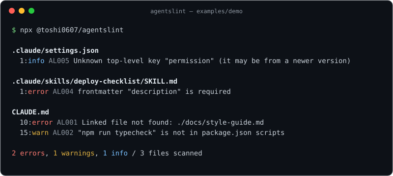

# agentslint

[](https://github.com/toshi0607/agentslint/actions/workflows/ci.yml)
[](https://www.npmjs.com/package/@toshi0607/agentslint)
[](LICENSE)

A CI linter for AI coding agent config files — `AGENTS.md`, `CLAUDE.md`, and the `.claude/` directory.

Agent config rots silently. Docs get moved, scripts get renamed, skills get malformed — and your agent quietly gets worse while burning tokens on instructions that no longer match reality. agentslint catches that in the same place you catch every other regression: CI.



Reproduce this locally with the intentionally broken demo project:

```bash
git clone https://github.com/toshi0607/agentslint && cd agentslint/examples/demo
npx @toshi0607/agentslint
```

## Quick start

### CLI

```bash
npx @toshi0607/agentslint                 # lint the current directory
npx @toshi0607/agentslint --format json   # pretty | json | sarif | github
```

Exit code is 1 if any `error`-severity finding exists, 0 otherwise — drop it straight into CI. After a global install (`npm i -g @toshi0607/agentslint`) the command is just `agentslint`.

### GitHub Action

```yaml
jobs:
  agentslint:
    runs-on: ubuntu-latest
    steps:
      - uses: actions/checkout@v4
      - uses: toshi0607/agentslint@v0.0.1
```

Findings show up as inline annotations on the PR's Files changed tab.

### Code scanning (SARIF)

```yaml
    permissions:
      contents: read
      security-events: write
    steps:
      - uses: actions/checkout@v4
      - uses: toshi0607/agentslint@v0.0.1
        with:
          sarif-file: agentslint.sarif
      - uses: github/codeql-action/upload-sarif@v3
        if: always()
        with:
          sarif_file: agentslint.sarif
```

## Rules

| ID | Name | What it catches | Default |
|---|---|---|---|
| AL001 | broken-file-reference | Relative links and CLAUDE.md `@import`s pointing at files that don't exist | error |
| AL002 | stale-command | Documented commands missing from package.json scripts / Makefile / justfile | warn |
| AL003 | token-budget | Files whose estimated token count exceeds a budget (default 4,000; approximate) | warn |
| AL004 | skill-frontmatter | Invalid SKILL.md frontmatter (name format/length, missing description) | error |
| AL005 | settings-schema | Invalid `.claude/settings.json` (JSON validity, known-key types, unknown keys) | error |

Planned: AL006 secret-pattern, AL007 boilerplate, AL008 duplicate-heading — see [DESIGN.md](DESIGN.md).

## Configuration

`.agentslintrc.json` (optional):

```json
{
  "rules": {
    "AL003": { "severity": "warn", "options": { "budget": 8000 } },
    "AL002": "off"
  },
  "ignore": ["fixtures/**"]
}
```

## Philosophy: zero false positives

A linter earns trust by never crying wolf, so agentslint under-matches by design: code fences are skipped, commands are only matched at command position (not inside comments or strings), and `@scope/package` in prose is never treated as an import. If a check can't be confident, it stays silent.

## Docs

- [README 日本語版](README.ja.md)
- [Design doc](DESIGN.md) (Japanese)

## License

[MIT](LICENSE)
